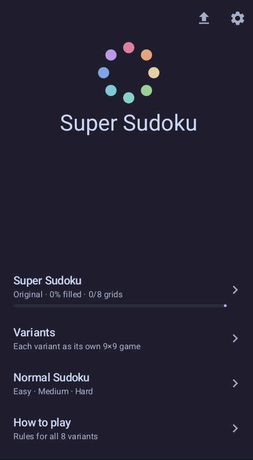
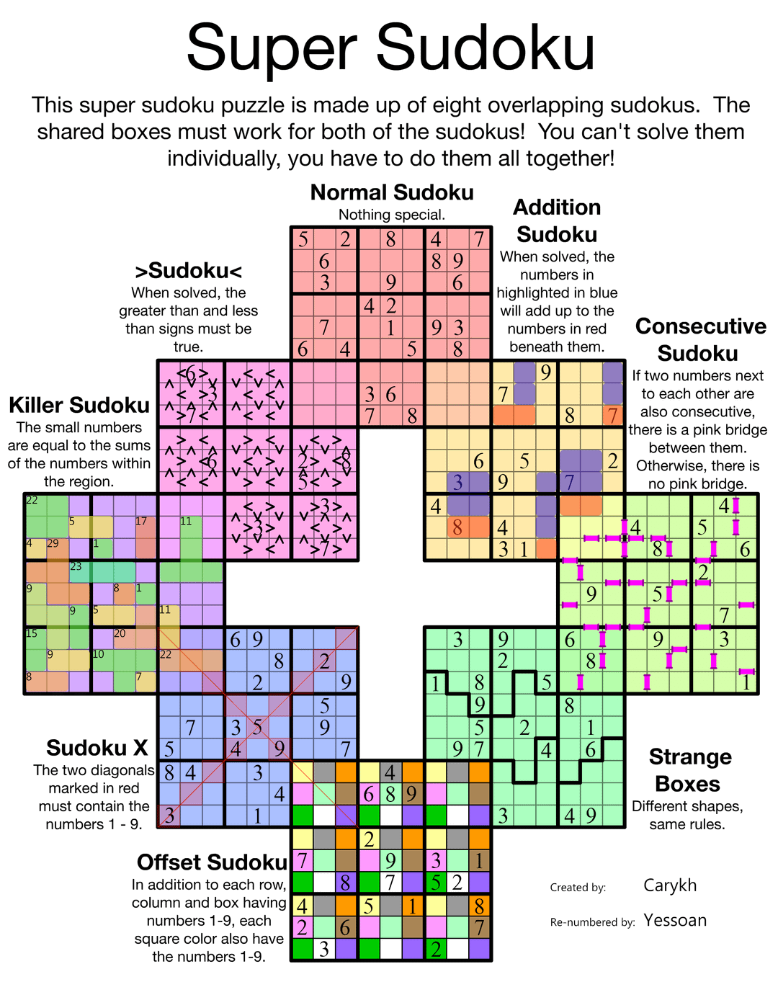

# Super Sudoku

Super Sudoku app for Android: carykh's 8-in-1 overlapping-variant ring,
plus each variant as its own 9×9, classic practice puzzles, and Penpa+ import.

## Screenshots

| Home | The Super Sudoku |
|---|---|
|  |  |

## Build

Requirements: JDK 17 and the Android SDK (API 36, build-tools 36.0.0).
With Nix: `nix develop` sets `JAVA_HOME`, `ANDROID_HOME`, and Python up;
otherwise install them yourself and accept the SDK licenses.

```sh
./gradlew :core:test              # core unit tests (solver/validate/import)
./gradlew :app:assembleDebug      # debug APK
./gradlew :app:bundleRelease      # unsigned release compile check
```

Always use `./gradlew` — the wrapper pins Gradle 8.14.4. Shared dependency
and plugin versions live in `gradle/libs.versions.toml`.

## Puzzle pipeline

The bundled ring starts as a Penpa+ URL (`docs/penpa-url.txt`, transcribed
from the poster; note the `(8,7)=3` transcription correction and the
`LABEL_MOVES` caveats documented in `scripts/emit_puzzle.py`):

```sh
python3 scripts/decode_penpa.py   # penpa-url.txt -> scripts/decode_raw.json
python3 scripts/emit_puzzle.py    # decode_raw.json -> app/src/main/assets/puzzle.json
./gradlew :core:solveSuper        # puzzle.json -> app/src/main/assets/solution.json
./gradlew :core:mintStandalone    # solution.json -> app/src/main/assets/standalone.json
```

`docs/mini-penpa-url.txt` is a tiny crafted URL used by `PenpaMiniTest`;
`scripts/craft_mini_penpa.py` regenerates it (to `/tmp`).

## Tests

```sh
./gradlew :core:test                              # fast JVM tests
./gradlew :app:connectedDebugAndroidTest           # on-device e2e (see app/src/androidTest)
```

## Signing and releases

Release signing needs all four values, either in `local.properties`
(`release.storeFile/storePassword/keyAlias/keyPassword`) or as
`KEYSTORE_PATH/KEYSTORE_PASSWORD/KEY_ALIAS/KEY_PASSWORD` env vars.
Setting only some of them fails the build fast rather than shipping a
half-signed APK. Key material is gitignored — never commit it.

Releases are cut by pushing a tag: `git tag v<versionName>` (must match
`versionName` in `app/build.gradle.kts`; CI checks this). The `Release`
workflow runs core tests, builds one signed universal APK (no splits, no
AAB), and publishes it with the matching `CHANGELOG.md` section as notes.
Bump `versionCode` on every release.

## Credits

- Puzzle design: carykh
- Penpa+ transcription: u/TheSudokuer
- Input conventions inspired by [Open Sudoku](https://opensudoku.moire.org/)
